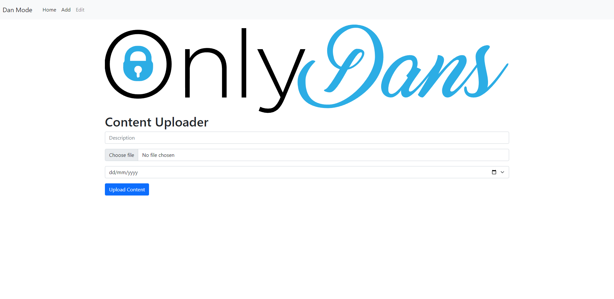
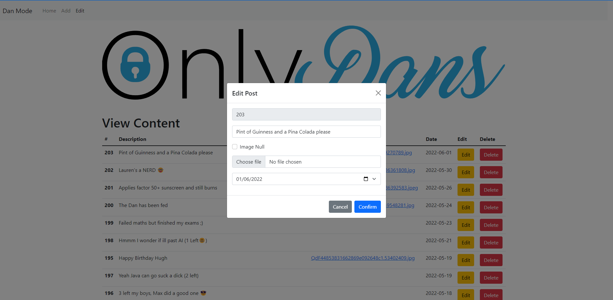

# OnlyDans 
The exclusive site for dan lee
---
This is the newer version of [OnlyDans](https://github.com/dan-lee76/onlydans) which uses reacthooks instead of the classes.

This is a media sharing site used only for people called Dan. (Currently only implemented for Dan Lee)
I have also created a custom backend using php for the site to retrieve data from a database.

View site: [onlydans.uk](https://go.danlee.uk/onlydans)

## Upcoming Features
- [x] Darkmode
- [x] Loading Darkmode
- [ ] Media View
  - [x] View all images available
  - [x] View date of image uploaded 
  - [x] Image navigation #6
  - [x] Download image from media view
  - [ ] Use thumbnails so media loads quicker
- [ ] Full unicode support
- [ ] Ability to play videos
  - [ ] Implement backend
  - [ ] Implement frontend
- [ ] Implement like mode
- [x] Autobuilds based on source code

## API
I have implemented a backend for [OnlyDans](https://go.danlee.uk/onlydans). This is a connection to the DB, and has the ability to modify the content displayed.
### getContent
You can view all of the data avalible at: [api.danlee.uk/getContent](https://api.danlee.uk/getContent). This will return a JSON string array with all of the content present on the site.
#### Usage
`api.danlee.uk/getContent?id=34` -> This will return a JSON string array for that specific id.

### Content Uploader (Closed Source)

The above image shows how im able to upload content to the website. This uses PHP to upload an image to the server, and compressess it if required. It then uses SQL to add date and description to the database. 

### Content Editor (Closed Source)

The above image shows how im able to edit posts, and delete them. When changing an image, it will delete it off the server. Theres also the ability to view the current image and edit any of the data of the post.
